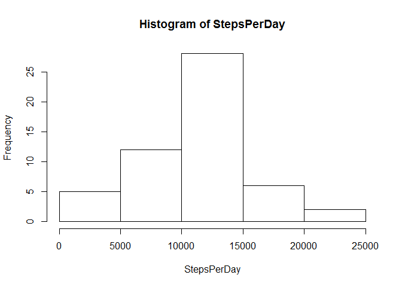
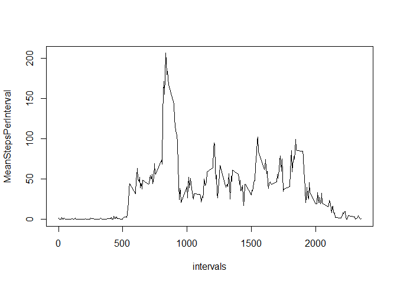
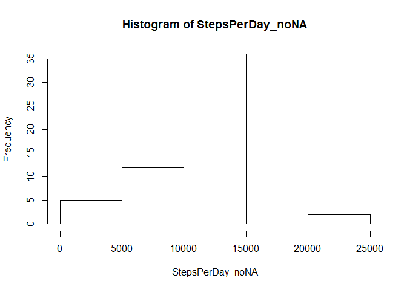
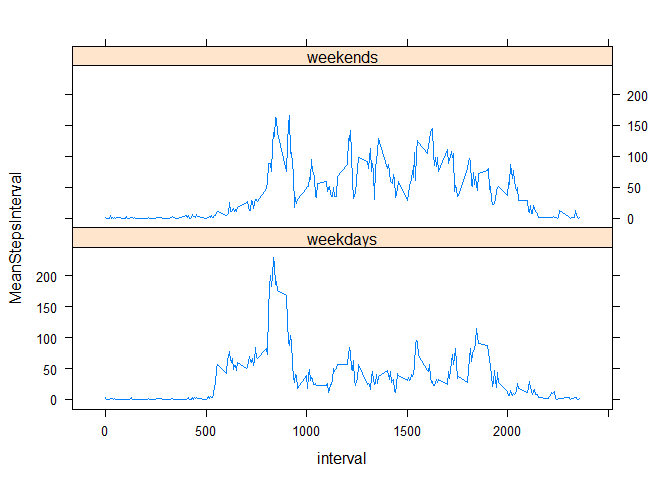

# Reproducible Research: Peer Assessment 1


## Loading and preprocessing the data  

- we load the .csv file  

```r
repdata <- read.csv("./activity.csv", sep=",", header=TRUE)
```

- we transform the date to the appropriate format  

```r
repdata$date <- as.Date(repdata$date)
```

## What is mean total number of steps taken per day?  
 
- we find the unique days in the dataframe  
- we sum the number of steps for each day to find the steps per day  
- we make a histogram of the total number of steps taken each day  

```r
days <- unique(repdata$date)
StepsPerDay <- numeric()
for (i in 1:length(days)) {
        StepsPerDay[i] <- sum(repdata$steps[which(repdata$date == days[i])])
}
hist(StepsPerDay)
```

 

- we calculate the mean and median total number of steps taken per day  

```r
MeanSteps <- mean(StepsPerDay, na.rm=TRUE)
MeanSteps
```

```
## [1] 10766.19
```

```r
MedianSteps <- median(StepsPerDay, na.rm=TRUE)
MedianSteps
```

```
## [1] 10765
```

The mean total steps taken per day = 1.0766189\times 10^{4}  
The median total steps taken per day = 1.0765\times 10^{4}  

## What is the average daily activity pattern  

- we find the unique values for the intervals  
- we find the mean number of steps for each interval over all days  
- we plot average number of steps taken over all days for each interval  

```r
intervals <- unique(repdata$interval)
MeanStepsPerInterval <- numeric()
for(i in 1:length(intervals)){
        MeanStepsPerInterval[i] <- mean(repdata$steps[which(repdata$interval == intervals[i])], na.rm=TRUE)
}
plot(intervals, MeanStepsPerInterval, type="l")
```

 

-we find the interval when the maximum steps were taken on average  

```r
maxInterval <- intervals[which(MeanStepsPerInterval == max(MeanStepsPerInterval))]
maxInterval
```

```
## [1] 835
```

The 5min interval when the  maximum number of steps taken on average  
across all days in the dataset = 835  

## Imputing missing values

- we find the missing values (NA) and report the number of rows where it occurs  

```r
bad <- is.na(repdata$steps)
rowNA <- length(bad[which(bad == TRUE)])
rowNA
```

```
## [1] 2304
```

The number of rows with NA values = 2304  

- To fill up the missing values we use the average steps over all days per interval
- We then input the value into the missing values in a new dataframe (FullData)

```r
IndexNA <- which(bad == TRUE)
FullData <- repdata 
for (ind in IndexNA){
        NewValue <- MeanStepsPerInterval[which(intervals == repdata$interval[ind])]
        FullData$steps[ind] <- NewValue
}
```

- Making a histogram of the total number of steps taken each day after missing values are imputed  

```r
StepsPerDay_noNA <- numeric()
for (i in 1:length(days)) {
        StepsPerDay_noNA[i] <- sum(FullData$steps[which(FullData$date == days[i])])
}
hist(StepsPerDay_noNA)
```

 

- calculating the mean and median total number of steps taken per day after missing values are imputed  

```r
MeanSteps_noNA <- mean(StepsPerDay_noNA)
MeanSteps_noNA
```

```
## [1] 10766.19
```

```r
MedianSteps_noNA <- median(StepsPerDay_noNA)
MedianSteps_noNA
```

```
## [1] 10766.19
```

The mean total steps taken per day after missing values are imputed= 1.0766189\times 10^{4}  
the mean is unaffected by the imputing, the values are the same before and after
  
The median total steps taken per day after missing values are imputed = 1.0766189\times 10^{4}  
the median has changed to reflect the same value as the mean after imputing


## Are there differences in activity patterns between weekdays and weekends?
  
- creating a factor variable for weekends and weekdays from the imputed dataset  

```r
daynames <- weekdays(FullData$date)
end_or_day <- character()
end_or_day[which(daynames == "Monday")] <- "weekday"
end_or_day[which(daynames == "Tuesday")] <- "weekday"
end_or_day[which(daynames == "Wednesday")] <- "weekday"
end_or_day[which(daynames == "Thursday")] <- "weekday"
end_or_day[which(daynames == "Friday")] <- "weekday"
end_or_day[which(daynames == "Saturday")] <- "weekend"
end_or_day[which(daynames == "Sunday")] <- "weekend"

end_or_day <- factor(end_or_day)
FullData$end_or_day <- end_or_day
```

- Plotting a panel plot containg the time series plot of the 5min interval and the average number of steps  
taken, averaged across all weekdays and weekends  

```r
MeanStepsPerInterval_Weekends <- numeric()
for(i in 1:length(intervals)){
        MeanStepsPerInterval_Weekends[i] <- mean(FullData$steps[which(FullData$end_or_day == "weekend" & FullData$interval == intervals[i])])
}
MeanStepsPerInterval_Weekdays <- numeric()
for(i in 1:length(intervals)){
        MeanStepsPerInterval_Weekdays[i] <- mean(FullData$steps[which(FullData$end_or_day == "weekday" & FullData$interval == intervals[i])])
}

interval <- c(intervals, intervals)
MeanStepsInterval <- c(MeanStepsPerInterval_Weekends,MeanStepsPerInterval_Weekdays)
day_or_end <- c(rep("weekends",length(intervals)), rep("weekdays",length(intervals)))
PlotFrame <- data.frame(interval, MeanStepsInterval, day_or_end)
library(lattice)
xyplot(MeanStepsInterval ~ interval | day_or_end, PlotFrame, layout=c(1,2), t="l")
```

 
